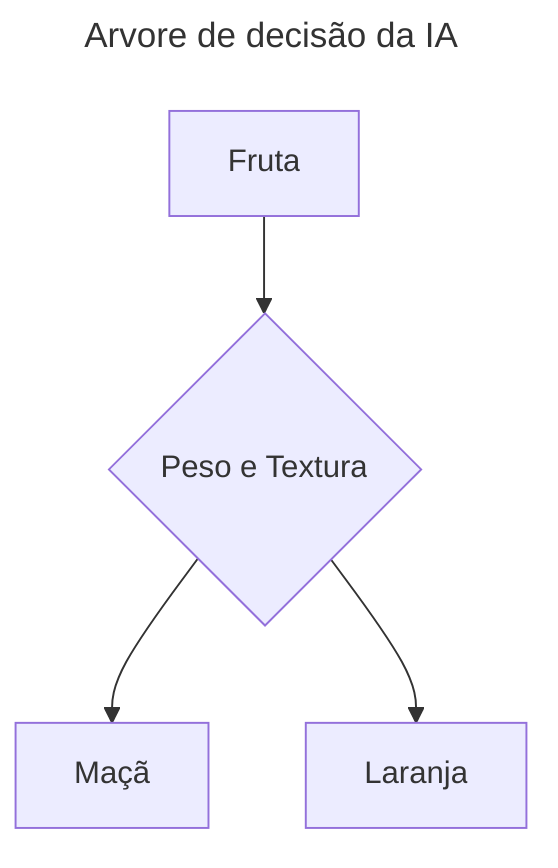

# IA: Aplle or Orange

<div style="text-align:center">



</div>

---
Essa IA tem o objetivo de aprender atravez de um arquivo de dados ```.csv``` a diferenciar uma laraja de uma maçã levando em consideração o ```Peso``` e ```Textura```.